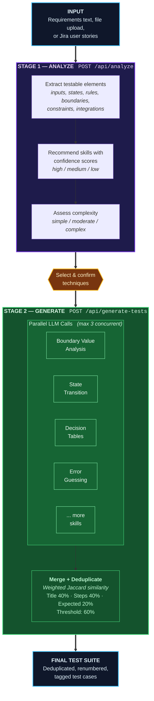
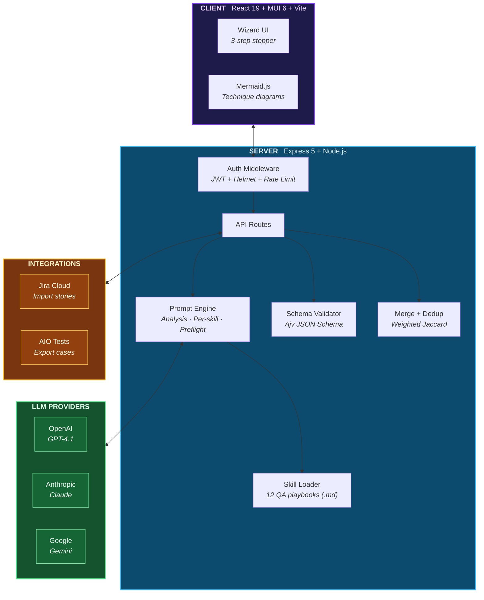
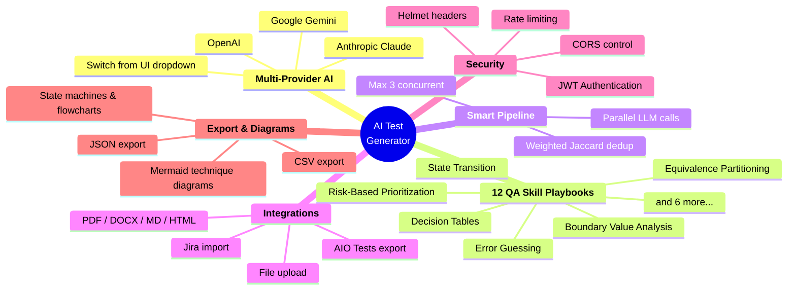
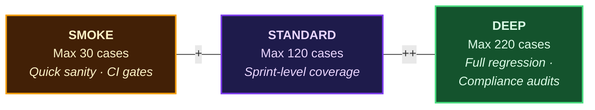

<div align="center">

<br/>


# AI Test Case Generator

### From requirements to production-ready test cases — in seconds, not hours.

<br/>

[](https://nodejs.org)
[](https://react.dev)
[](https://expressjs.com)
[](https://mui.com)
[](LICENSE)

<br/>

**OpenAI** &nbsp;·&nbsp; **Anthropic Claude** &nbsp;·&nbsp; **Google Gemini** &nbsp;·&nbsp; **Jira Import** &nbsp;·&nbsp; **AIO Tests Export**

---

**12 QA techniques** &nbsp;&nbsp;|&nbsp;&nbsp; **Parallel AI generation** &nbsp;&nbsp;|&nbsp;&nbsp; **Smart deduplication** &nbsp;&nbsp;|&nbsp;&nbsp; **Visual technique diagrams**

<br/>

</div>

## Overview

A skills-driven test case generation platform that uses AI to analyze software requirements and produce structured, high-quality test scenarios. It mirrors how a senior QA engineer thinks — analyze first, then apply the right testing techniques.

---

## 3-Step Wizard Flow


---

## How It Works — The AI Pipeline



---

## Architecture Overview



---

## Features at a Glance



---

## QA Skills Library

12 expert playbooks in `skills/` that guide the AI like a test design handbook:

| # | Skill | What It Targets |
|---|-------|----------------|
| 1 | **Equivalence Partitioning** | Input domain classes — valid & invalid partitions |
| 2 | **Boundary Value Analysis** | Off-by-one, limits, edges of input ranges |
| 3 | **Decision Tables** | Complex business rules with multiple conditions |
| 4 | **State Transition** | Stateful workflows, lifecycle transitions |
| 5 | **Pairwise / Combinatorial** | Multi-parameter interactions, config combinations |
| 6 | **Error Guessing & Heuristics** | Common failure modes, past-bug patterns |
| 7 | **Risk-Based Prioritization** | High-impact, high-likelihood scenarios first |
| 8 | **Requirements Traceability** | Full requirement-to-test coverage mapping |
| 9 | **Feature Decomposition** | Breaking features into atomic testable units |
| 10 | **Functional Core** | Core happy-path and business logic validation |
| 11 | **Non-Functional Baseline** | Performance, security, usability baselines |
| 12 | **General Fallback** | Catch-all baseline — always included |

---

## Test Depth Modes



---

## Test Case Output

Each generated test case is structured and atomic:

```json
{
  "id": "TC-001",
  "title": "Verify that login fails with invalid password",
  "type": "negative",
  "priority": "P0",
  "preconditions": ["User has a registered account"],
  "steps": [
    "Navigate to login page",
    "Enter valid email",
    "Enter invalid password",
    "Click Sign In"
  ],
  "expected": [
    "Error message: 'Invalid credentials'",
    "User remains on login page"
  ],
  "coverageTags": ["authentication", "boundary-value-analysis"],
  "requirementRefs": ["REQ-001"]
}
```

**Types:** `functional` · `negative` · `boundary` · `security` · `accessibility` · `performance` · `usability` · `compatibility` · `resilience`

**Priorities:** `P0` Critical · `P1` High · `P2` Medium · `P3` Low

---

## Technique Diagrams

Optional Mermaid.js diagrams visualize how each technique applies to your requirement:

| Technique | Diagram Type | Visualization |
|-----------|-------------|---------------|
| State Transition | `stateDiagram-v2` | State machines with transitions |
| Decision Tables | `flowchart TD` | Decision flows with condition branches |
| Equivalence Partitioning | `flowchart LR` | Partition ranges and classes |
| Boundary Value Analysis | `flowchart LR` | Boundary points on value ranges |
| Pairwise / Combinatorial | `flowchart TD` | Combination trees |
| Feature Decomposition | `mindmap` | Feature hierarchy maps |

Diagrams are opt-in per technique — no extra tokens consumed when not selected.

---

## Available AI Models

Selectable from the UI dropdown:

| Provider | Default Model | Other Options |
|----------|--------------|---------------|
| **OpenAI** | GPT-4.1 | GPT-4.1 Mini, GPT-4.1 Nano, GPT-4o, GPT-4o Mini |
| **Anthropic** | Claude Sonnet 4.5 | Claude Haiku 3.5 |
| **Gemini** | Gemini 2.5 Flash | Gemini 2.0 Flash, Gemini 1.5 Pro, Gemini 1.5 Flash |

---

## Quick Start

### Prerequisites

- **Node.js 18+** (20+ recommended)
- An API key for at least one provider:
  [OpenAI](https://platform.openai.com/api-keys) · [Anthropic](https://console.anthropic.com/settings/keys) · [Google AI Studio](https://aistudio.google.com/apikey)

### Install & Run

```bash
# Clone
git clone https://github.com/rameshlakmal/Test-Scenario-Generator.git
cd Test-Scenario-Generator

# Install dependencies
npm install && cd client && npm install && cd ..

# Configure
cp .env.example .env
# Edit .env — add at least one API key

# Start (server + client with hot reload)
npm run dev
```

Open **http://localhost:5173** and start generating.

---

## Configuration

All settings live in `.env`:

| Variable | Default | Description |
|----------|---------|-------------|
| `LLM_PROVIDER` | `openai` | Active provider: `openai`, `anthropic`, or `gemini` |
| `OPENAI_API_KEY` | — | OpenAI API key |
| `ANTHROPIC_API_KEY` | — | Anthropic API key |
| `GEMINI_API_KEY` | — | Google Gemini API key |
| `PORT` | `3001` | Server port |
| `MAX_UPLOAD_MB` | `2` | Max file upload size (MB) |
| `MAX_TEST_CASES` | `160` | Hard cap on generated test cases |
| `LLM_TIMEOUT_MS` | `45000` | LLM request timeout (ms) |
| `RATE_LIMIT_PER_MINUTE` | `90` | API rate limit per minute |
| `CORS_ORIGINS` | `localhost:5173` | Allowed origins (comma-separated or `*`) |

<details>
<summary><strong>Jira Integration (Optional)</strong></summary>

```env
JIRA_BASE_URL=https://your-domain.atlassian.net
JIRA_EMAIL=you@company.com
JIRA_API_TOKEN=your-token
```

Enables the **Import from Jira** tab in Step 1 — browse projects, epics, sprints, and pull user stories directly.

</details>

<details>
<summary><strong>AIO Tests Export (Optional)</strong></summary>

```env
AIO_BASE_URL=https://tcms.aiojiraapps.com/aio-tcms
AIO_TOKEN=your-token
```

Push generated test cases to [AIO Tests](https://marketplace.atlassian.com/apps/1222843) with auto-created folder hierarchies, priority mapping, and coverage tags.

</details>

---

## API Reference

| Method | Endpoint | Description |
|--------|----------|-------------|
| `GET` | `/api/health` | Health check |
| `GET` | `/api/skills` | List loaded QA skills |
| `POST` | `/api/preflight` | Identify ambiguities before generation |
| `POST` | `/api/analyze` | Analyze requirement, recommend techniques |
| `POST` | `/api/generate-tests` | Generate test suite (per-skill parallel) |
| `GET` | `/api/jira/projects` | List Jira projects |
| `GET` | `/api/jira/stories` | Search stories with filters |
| `POST` | `/api/jira/story-details` | Fetch full story details |
| `POST` | `/api/aio/push` | Export test cases to AIO Tests |

> All routes except `/api/health` and `/api/auth/*` require JWT authentication.

---

## Project Structure

```
test-generator/
│
├── server/                         ← Express.js backend (CommonJS)
│   ├── index.js                    # Routes, orchestration, main entry
│   ├── prompt.js                   # Prompt builders (analysis, per-skill, legacy, preflight)
│   ├── schema.js                   # JSON schemas for validation (Ajv)
│   ├── util.js                     # JSON parsing, dedup, suite merging
│   ├── selectSkills.js             # Keyword-based skill selection (fallback)
│   ├── skills.js                   # Skill loader (parses markdown playbooks)
│   ├── auth.js                     # JWT authentication routes
│   ├── authMiddleware.js           # Route protection middleware
│   ├── jira.js                     # Jira Cloud API integration
│   ├── aio.js                      # AIO Tests export
│   └── llm/
│       ├── index.js                # Provider router
│       ├── openai.js               # OpenAI adapter
│       ├── anthropic.js            # Anthropic Claude adapter
│       └── gemini.js               # Google Gemini adapter
│
├── client/                         ← React + Vite SPA (ESM)
│   └── src/
│       ├── App.jsx                 # Main shell, state, stepper orchestration
│       ├── StepRequirements.jsx    # Step 1: input, provider, Jira import
│       ├── StepAnalyze.jsx         # Step 2: analysis, technique selection
│       ├── StepResults.jsx         # Step 3: results, filters, export
│       ├── DiagramDialog.jsx       # Fullscreen Mermaid diagram viewer
│       ├── MermaidDiagram.jsx      # Mermaid.js renderer
│       ├── helpers.jsx             # Shared utility components
│       └── theme.js                # Theme constants, model options
│
├── skills/                         ← 12 QA technique playbooks (.md)
│   ├── boundary-value-analysis.md
│   ├── equivalence-partitioning.md
│   ├── decision-tables.md
│   ├── state-transition.md
│   └── ...
│
├── web/                            ← Static files served by Express
├── .env.example                    # Environment variable template
└── package.json
```

---

## Tech Stack

| Layer | Technology |
|-------|-----------|
| **Backend** | Express.js 5, Node.js 18+, Ajv, JWT, Helmet |
| **Frontend** | React 19, Material UI 6, Vite 7 |
| **Diagrams** | Mermaid.js 11 |
| **AI Providers** | OpenAI, Anthropic Claude, Google Gemini |
| **Integrations** | Jira Cloud REST API, AIO Tests TCMS |
| **File Parsing** | pdf-parse, mammoth (DOCX), cheerio (HTML) |
| **Theme** | MUI dark theme with violet accent (`#a78bfa`) |

---

<div align="center">

<br/>

**Built so QA engineers can focus on thinking, not typing.**

<br/>

*Star the repo if this saves you time.*

</div>
